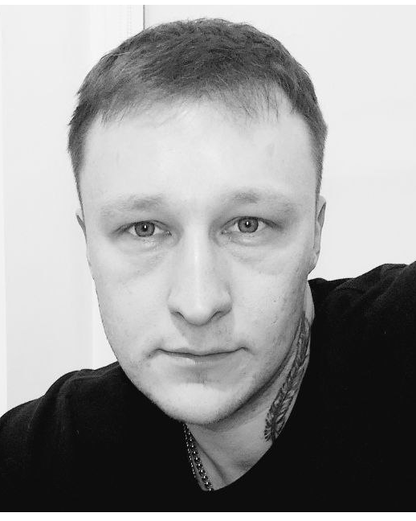

**Aliaksandr Zhyzneuski**


**Contacts**

Poland  
_Phone: +48780725540 (WhatsApp)_  
_Telegram: @Kainkid_
_Sky: ZhiznevskiyAS_  
[Linkedin](https://www.linkedin.com/in/aliaksandr-zhyzneuski-3059b4225/)

**About Me**

_My_ _name_ _is_ _Aliaksandr_, _and_ _I_ _am_ _interested_ _in_ _working_ _in_ _the_ _IT_
_field_. _I_ _have_ _degree_ _in_ _information_ _technology_ _and_ _14_ _years_ _of_
_experience_ _in_ _IT_. _My_ _profile_ _includes_ _knowledge_ _and_ _skills_ _in_ _server_ _administration_,
_network_ _technologies_, _IT_ _system_ _monitoring_, _technical_ _support_, _configuring_ _network_ _equipment_,
_as_ _well_ _as_ _experience_ _working_ _with_ _various_ _operating_ _systems_ _such_ _as_
_Windows_, _Windows_ _Server_, _and_ _Linux_.
_I_ _always_ _strive_ _for_ _self-improvement_, _so_ _I_ _am_ _constantly_ _learning_
_new_ _technologies_ _and_ _tools_ _to_ _enhance_ _my_ _knowledge_ _and_ _skills_. _I_
_am_ _also_ _confident_ _in_ _my_ _communication_ _skills_, _which_ _allows_ _me_ _to_
_work_ _effectively_ _in_ _a_ _team_.
_I_ _am_ _ready_ _to_ _apply_ _my_ _knowledge_ _and_ _skills_ _to_ _contribute_ _to_ _the_
_development_ _of_ _your_ _company_ _and_ _achieve_ _common_ _goals_.

**Skills**

Windows/Linux,  
Python,  
HTML/CSS/JavaScript,  
Network, TCP/IP, DNS,  
SQL/NoSQL,  
Zabbix, VMWare,  
Git.

**Code Example**

```
const createTemplate = (tasks, index) => {
   return `
      <div div class="todo-item ${tasks.completed ? 'checked' : ''}" >
   <div class="description">${tasks.description}</div>
   <div class="buttons">
      <input onclick="completeTask(${index})" class="btn-complete" type="checkbox" ${tasks.completed ? 'checked' : ''}>
      <button onclick="deleteTask(${index})" class="btn-delete">Delete</button>
   </div>
</div >
   `
}

const filterTask = () => {
   const activeTasks = tasks.length && tasks.filter(item => item.completed == false);
   const completedTasks = tasks.length && tasks.filter(item => item.completed == true);
   tasks = [...activeTasks, ...completedTasks];
}
```

**Experience**

Software Administrator, BelinvestBank, Belarus, Minsk  
November 2018 - June 2022

Support Specialist, Business Network, Belarus, Minsk  
June 2007 - May 2018

**Education**

Information technology software, Belarusian State University of
Informatics and Radioelectronics(BSUIR)  
September 2011 - May 2016  
Modern Front-End with JavaScript & HTML5, BelHard Group  
March 2021 - May 2021
Front-End development. Advanced level , IBA Institute  
January 2022 - March 2022

**Languages**

English: B1;  
Russian: C2;  
Belorussian: C1;  
Polish: B1.
